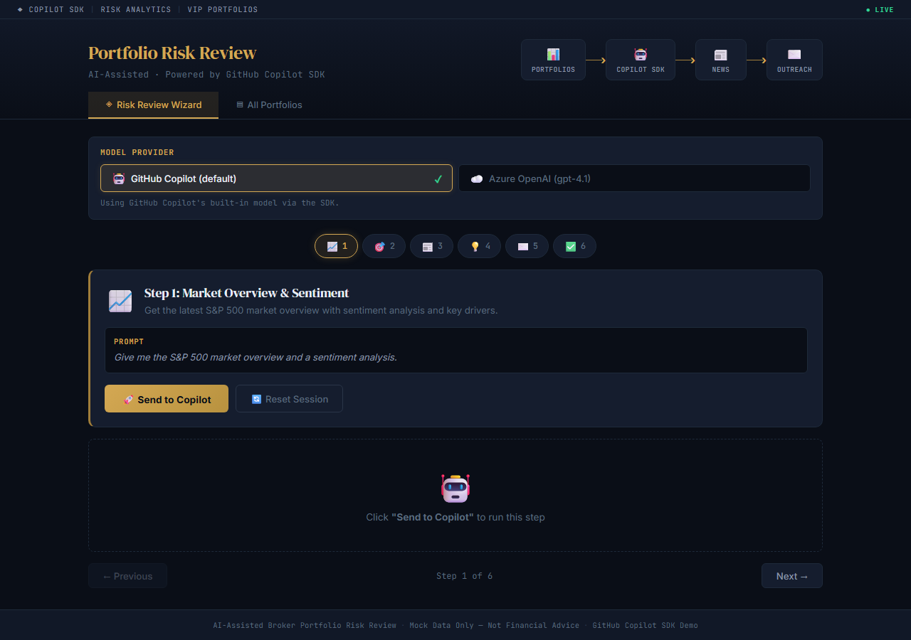
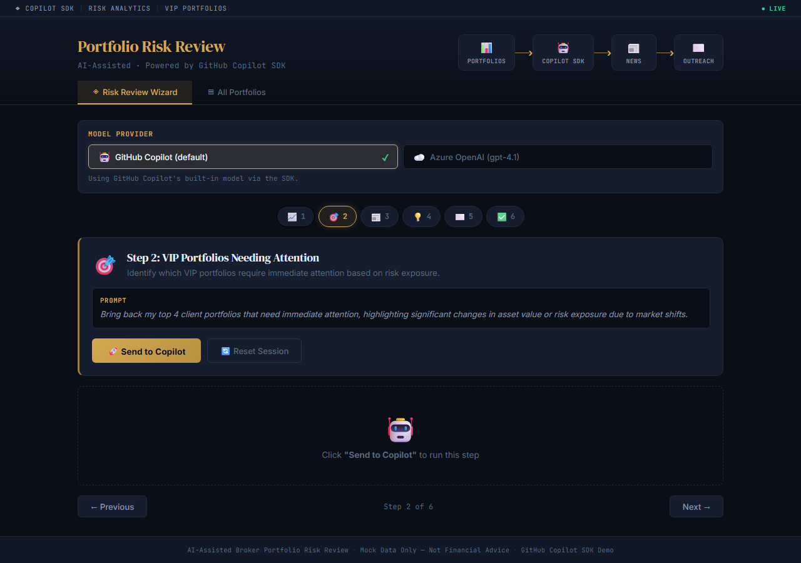
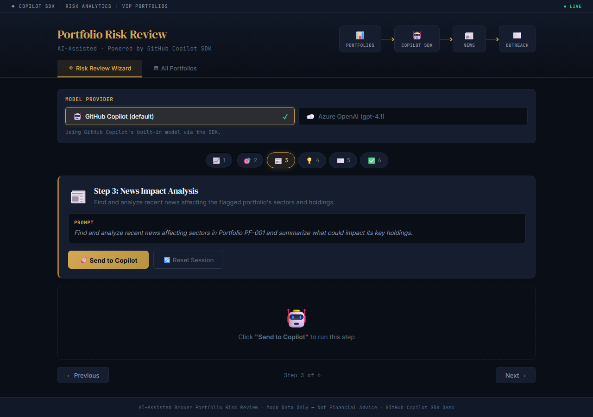
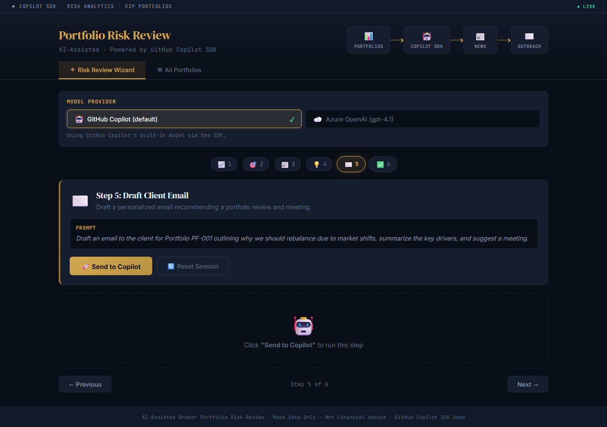
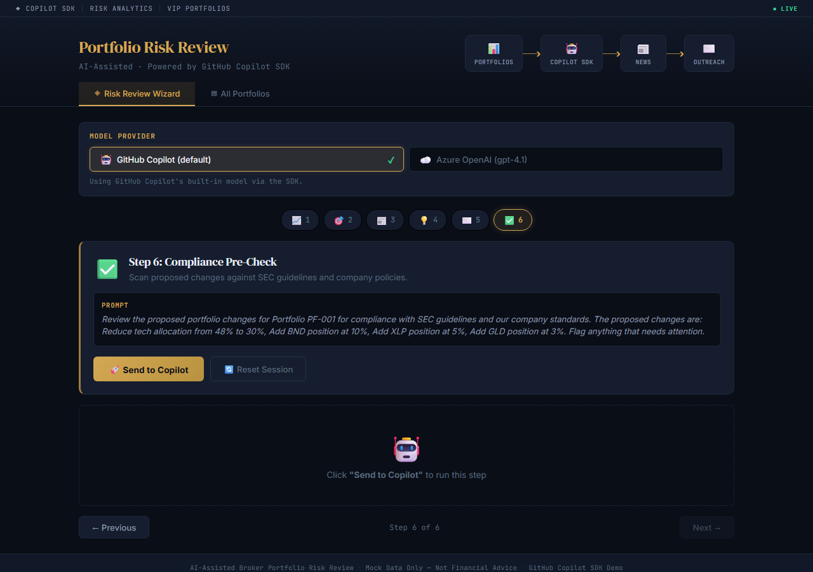
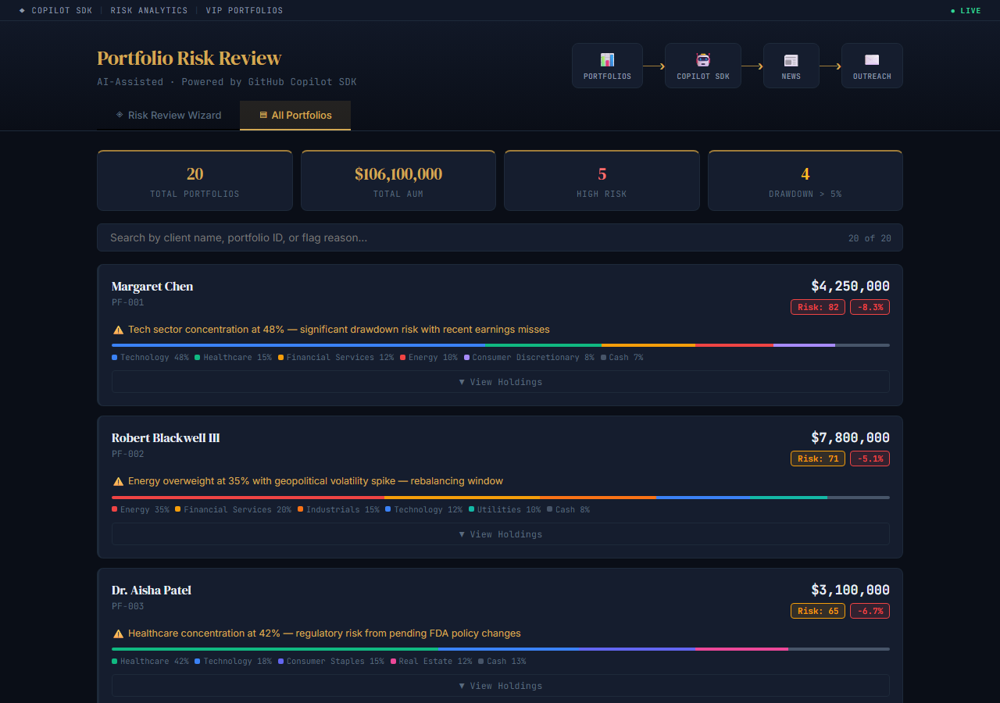
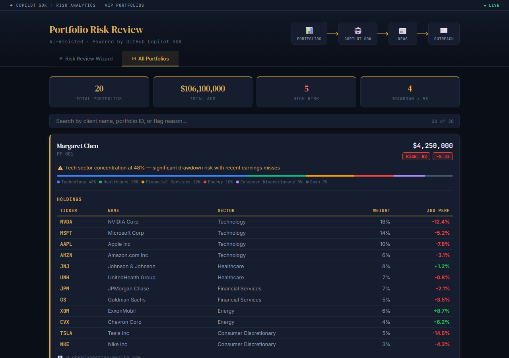

# AI-Assisted Broker Portfolio Risk Review

A 3-minute demo showcasing the **GitHub Copilot SDK** for agentic workflows in financial services. The application walks a broker through a 6-step portfolio risk review — from market analysis to compliance pre-check — powered by Copilot tool invocation, multi-turn sessions, and SSE streaming.

## Demo
https://www.youtube.com/watch?v=SRtzNyrPUW0&t=84s
## Architecture

```
React (Vite)            Express API            GitHub Copilot SDK
┌──────────────┐       ┌──────────────┐       ┌──────────────────┐
│  StepWizard  │──SSE──│ POST /api/   │──SDK──│  CopilotClient   │
│  ModelSelect │       │   chat       │       │  createSession   │
│  ChatPanel   │       │   providers  │       │  sendAndWait     │
│  Portfolio   │       │   portfolios │       │  ProviderConfig  │
│  List        │       │   reset      │       │  (BYOM toggle)   │
└──────────────┘       └──────┬───────┘       └──────┬───────────┘
                              │                      │
                     ┌────────┴────────┐      ┌──────┴───────┐
                     │ 6 Custom Tools  │      │  AGENTS.md   │
                     │ (defineTool)    │      │ (system      │
                     │                 │      │  instructions)│
                     └────────┬────────┘      └──────────────┘
                              │
                     ┌────────┴────────┐
                     │  Mock JSON Data │
                     │  (portfolios,   │
                     │   news, opps,   │
                     │   compliance)   │
                     └─────────────────┘
```

## Demo Flow (6 Steps)

| Step | Tool Called | What Happens |
|------|-----------|--------------|
| 1. Market Overview | `getMarketOverview` | S&P 500 snapshot, sentiment analysis, key drivers |
| 2. Portfolio Triage | `getPortfoliosNeedingAttention` | Ranks 20 VIP portfolios by urgency score |
| 3. News Impact | `getRelevantNews` | Cross-references portfolio sectors with breaking news |
| 4. Opportunities | `getInvestmentOpportunities` | Matches defensive/diversification plays to weak sectors |
| 5. Draft Email | `draftClientEmail` | Generates personalized client outreach with disclaimers |
| 6. Compliance | `runComplianceScan` | Evaluates proposed changes against 8 SEC/company rules |

## Screenshots

### Landing Page & Model Selector
The financial terminal-themed UI with the step wizard, BYOM model toggle, and data pipeline header.


### Step 1: Market Overview & Sentiment
S&P 500 snapshot with sector performance table, key drivers, and sentiment analysis — all generated by Copilot from the `get_market_overview` tool.



### Step 2: VIP Portfolios Needing Attention
Top 4 at-risk portfolios ranked by urgency score with distressed holdings and concentration flags.



### Step 3: News Impact Analysis
Cross-referenced news items matched to portfolio sectors and tickers with sentiment and impact level.



### Step 4: Investment Opportunities
Defensive and diversification opportunities scored by relevance to the portfolio's weak sectors.


### Step 5: Draft Client Email
Personalized outreach email with market drivers, recommendations, and regulatory disclaimers — ready to send.



### Step 6: Compliance Pre-Check
SEC and company policy scan of proposed changes with severity flags and required actions.



### All Portfolios Dashboard
Full portfolio explorer with search, summary strip, and expandable holdings tables.





## Prerequisites

- **Node.js** ≥ 18
- **GitHub Copilot** subscription (Individual, Business, or Enterprise)
- Authenticated via `gh auth login` (GitHub CLI)
- *(Optional)* **Azure OpenAI** deployment for Bring-Your-Own-Model (BYOM)

## Quick Start

```bash
# Install dependencies
npm install

# (Optional) Configure Azure OpenAI — copy and fill in your values
cp .env.example .env

# Start both API and frontend
npm run dev
```

This starts:
- **API** at `http://localhost:3001` (Express + Copilot SDK)
- **Frontend** at `http://localhost:5173` (React + Vite)

Open `http://localhost:5173` and walk through each step.

## Azure OpenAI BYOM (Bring Your Own Model)

The app supports switching between **GitHub Copilot** (default) and a self-hosted **Azure OpenAI** endpoint at runtime via the model selector in the UI.

### Setup

1. Create a `.env` file from the template:
   ```bash
   cp .env.example .env
   ```
2. Fill in your Azure OpenAI values:
   ```env
   AZURE_OPENAI_BASE_URL=https://<your-resource>.openai.azure.com
   AZURE_OPENAI_API_KEY=<your-key>
   AZURE_OPENAI_DEPLOYMENT=gpt-4o           # your deployment name
   AZURE_OPENAI_API_VERSION=2024-10-21      # optional, defaults to 2024-10-21
   ```
3. Restart the dev server — the Azure OpenAI option will appear in the model selector.

### How It Works

- The `GET /api/providers` endpoint returns available model providers based on environment configuration.
- The frontend `ModelSelector` component fetches providers and lets users toggle between them.
- When Azure OpenAI is selected, the SDK `SessionConfig.provider` is configured with `type: "azure"`, the base URL, API key, and API version via `ProviderConfig`.
- Switching providers mid-session automatically destroys the old session and creates a new one.

## SDK Capabilities Showcased

| Capability | Where Used |
|-----------|------------|
| `CopilotClient` + `createSession` | [src/api/routes/chat.ts](src/api/routes/chat.ts) |
| `sendAndWait` with streaming | [src/api/routes/chat.ts](src/api/routes/chat.ts) |
| `defineTool` with JSON Schema | [src/api/tools/](src/api/tools/) |
| `AGENTS.md` for system instructions | [AGENTS.md](AGENTS.md) |
| `ProviderConfig` (BYOM) | [src/api/routes/chat.ts](src/api/routes/chat.ts) — Azure OpenAI toggle |
| Session hooks (`onPreToolUse`) | [src/api/routes/chat.ts](src/api/routes/chat.ts) |
| Multi-turn context accumulation | Session persists across all 6 steps |

## Project Structure

```
├── AGENTS.md                    # Agent instructions (role, tone, safety)
├── .env.example                 # Azure OpenAI configuration template
├── data/
│   ├── portfolios.json          # 20 VIP client portfolios
│   ├── news.json                # 10 market news items
│   ├── opportunities.json       # 8 investment opportunities
│   └── compliance-rules.json    # 8 SEC & company rules
├── src/
│   ├── api/
│   │   ├── server.ts            # Express entry point (port 3001)
│   │   ├── routes/chat.ts       # SSE streaming + session mgmt + BYOM
│   │   └── tools/               # 6 tool definitions
│   │       ├── marketOverview.ts
│   │       ├── portfolioAttention.ts
│   │       ├── relevantNews.ts
│   │       ├── investmentOpportunities.ts
│   │       ├── draftEmail.ts
│   │       ├── complianceScan.ts
│   │       └── index.ts
│   └── web/
│       ├── vite.config.ts
│       ├── index.html
│       └── src/
│           ├── main.tsx
│           ├── App.tsx           # Tab nav + model selector state
│           ├── hooks/useChat.ts  # SSE hook with provider support
│           └── components/
│               ├── StepWizard.tsx      # 6-step wizard
│               ├── ChatPanel.tsx       # Markdown rendering
│               ├── ModelSelector.tsx   # BYOM provider toggle
│               └── PortfolioList.tsx   # All-portfolios view
└── package.json
```

## Responsible AI

- All data is **mock/simulated** — no real client data is used
- Tool outputs include appropriate **disclaimers**
- Compliance scan is a **pre-check**, not a substitute for real compliance review
- Email drafts include standard **regulatory disclaimers**
- The agent never gives definitive investment advice

## Available Scripts

| Script | Description |
|--------|------------|
| `npm run dev` | Start API + frontend concurrently |
| `npm run dev:api` | Start Express API only |
| `npm run dev:web` | Start Vite frontend only |
